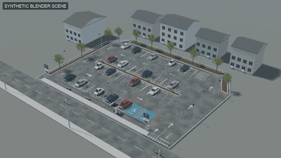
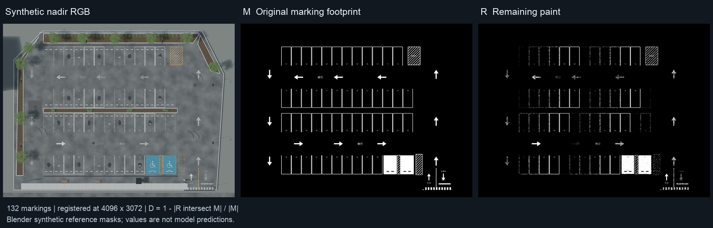

<div align="center">

# Recover-then-Measure：先恢复，再测量

**基于混合分割与自适应二值化的无人机影像停车场路面标线退化定量评估**

[English](README.md) · **简体中文** · [日本語](README.ja.md) · [한국어](README.ko.md) · [Deutsch](README.de.md) · [Français](README.fr.md)

[](https://liuzhentao173-cmyk.github.io/Quantitative-assessment-of-parking-lot-pavement-marking-degradation/?lang=zh)
[](https://doi.org/10.5281/zenodo.20825454)
[](#引用)

<br>
<a href="https://liuzhentao173-cmyk.github.io/Quantitative-assessment-of-parking-lot-pavement-marking-degradation/"></a>

</div>

Zhentao Liu, Jiaming Liu, Zhengtao Xie, Kai Xue, Shan Gu, Ji Dang

本代码以单张停车场无人机正射影像为输入，输出逐区域的**退化指数 D**、**空间退化热图**，以及附带**测量不确定度**的**维护等级**。流程分两步：先**恢复**每条标线的原始区域（包括漆料已磨掉的部分），再**测量**该区域内仍然残留的漆料。

> **[▶ 打开交互演示](https://liuzhentao173-cmyk.github.io/Quantitative-assessment-of-parking-lot-pavement-marking-degradation/?lang=zh)**：鼠标划过任意车位，即可看到它的原始区域 *M*、残留漆料 *R*、退化指数 *D* 和维护等级。



演示场景是用 Blender 建模并渲染的停车场。掩膜和数值来自场景几何与漆料材质，属于合成参考值，并非模型预测；场景中所有标线都计入（车位线、编号、箭头、文字、斜线区、轮椅标志、人行横道、停止线与车道线，以及蓝色无障碍车位涂装，共 132 个），每个数值按一个完整标线计算；R 按像素中心取值，不做抗锯齿。

## 流程

```
无人机正射影像 ─▶ 01 分割 ─▶ M_Pred ─▶ 02 二值化 ─▶ R_Pred ─▶ 03 指数 + 热图
                                                                │
                 双掩膜真值 (M_GT, R_GT) ─▶ 04 验证 ─▶ 05 不确定度 + 分级
```

| 脚本 | 阶段 | 功能 |
|---|---|---|
| `01_segment_marking_roi.py` | 分割 | SegFormer 分块推理并拼接，得到预测标线区域 `M_Pred` |
| `02_binarize_residual_paint.py` | 二值化 | 加权 KDE–GMM 自适应阈值（含阴影补偿与守护回退），得到残留漆料掩膜 `R_Pred` |
| `03_degradation_index_heatmap.py` | 量化 | 窗口级退化指数 `D` 与空间热图 |
| `04_downstream_gt_validation.py` | 验证 | 与真值对比的分解验证（`D_GT` 对 `D_Pred`），并为每个阶段构造交叉替换结果 |
| `05_measurement_evaluation.py` | 测量评价 | 误差归因；窗口、单条标线、整幅影像三种尺度的扩展不确定度；手册等级分布；三级维护等级与重涂判定 |

退化指数即日本维护实践中使用的剥离率：

$$D = 1 - \frac{|R \cap M|}{|M|}$$

| 等级 | D 的范围 | 维护措施 |
|---|---|---|
| I | D < 0.23 | 常规巡检 |
| II | 0.23 ≤ D < 0.40 | 安排重涂 |
| III | D ≥ 0.40 | 优先重涂 |

## 仓库结构

```
.
├── Coding/
│   ├── Operation/                              # 处理管线，阶段 01–05
│   │   ├── 01_segment_marking_roi.py
│   │   ├── 02_binarize_residual_paint.py
│   │   ├── 03_degradation_index_heatmap.py
│   │   ├── 04_downstream_gt_validation.py
│   │   ├── 05_measurement_evaluation.py
│   │   └── comparison/                         # 对比图表背后的分析脚本
│   │       ├── compare_binarization_methods.py       # 本方法 vs Otsu / WKDE-GMM / Fixed-L / Fixed-S
│   │       ├── compare_methods_scatter.py            # 上述方法的窗口/对象级散点指标
│   │       ├── sensitivity_parameter_sweep.py        # 对 8 个二值化参数逐一扫描
│   │       ├── sensitivity_compute_metrics.py        # 扫描结果的 mIoU / 面积加权 MAE
│   │       ├── run_all_models.py                     # 对每个分割模型运行 02/03/04
│   │       └── extract_crossmodel_downstream_metrics.py
│   └── Train/                                  # 分割模型训练 notebook（Colab, A100）
│       ├── Segformer-Backbone-Comparision.ipynb      # SegFormer，MiT 系列骨干
│       ├── FPN-Comparison-A100.ipynb                 # FPN，ResNet-34/50/101
│       ├── UNet++-Comparison-A100.ipynb              # UNet++，ResNet-34/50/101
│       └── deeplabv3+.ipynb                          # DeepLabV3+，ResNet-34/50/101
└── docs/                                       # 交互演示（GitHub Pages）
```

notebook 中保留了训练曲线。数据集影像不公开，因此输出中的样例图块已删除。

## 掩膜记号

| 论文 | 含义 | 代码内标记 |
|---|---|---|
| `M_GT` | 真值标线区域 | A1 |
| `R_GT` | 真值残留漆料 | A2 |
| `M_Pred` | 预测标线区域 | A3 |
| `R_Pred` | 预测残留漆料 | A4 |

代码中的变量名、CSV 列名（如 `GT_A1_D`）和 `--help` 文本使用简写标记。

## 环境依赖

- Python 3.9+
- 阶段 02–05 与 `comparison/`：
  ```bash
  pip install numpy pandas opencv-python scipy matplotlib pillow tqdm
  ```
- 阶段 01 另需 `pip install torch transformers` 以及训练好的权重（见下文）。

## 预训练权重

SegFormer 权重 `MiTB0.pt` … `MiTB5.pt` 已存档于 Zenodo：[doi:10.5281/zenodo.20825454](https://doi.org/10.5281/zenodo.20825454)。管线使用 **`MiTB5.pt`**（论文最终选定的 SegFormer MiT-B5），将 `01_segment_marking_roi.py` 中的 `WEIGHT_PATH`（或 `--weight-path`）指向该文件即可。

## 使用方法

每个脚本顶部都有一段简短的配置块（路径处标有 `# TODO: set path`），多数脚本也支持命令行参数（`--help`）。在 `Coding/Operation/` 下运行：

```bash
cd Coding/Operation
python 01_segment_marking_roi.py            # -> M_Pred
python 02_binarize_residual_paint.py        # -> R_Pred
python 03_degradation_index_heatmap.py      # -> 窗口级 D + 热图
python 04_downstream_gt_validation.py       # -> window_level_validation.csv

python 05_measurement_evaluation.py \
    --m-gt   <M_GT 目录>  --r-gt   <R_GT 目录> \
    --m-pred <M_Pred 目录> --r-pred <R_Pred 目录> \
    --window-csv     <04 输出>/window_level_validation.csv \
    --stage2-objects <02 输出>/all_output_info.csv \
    --out <输出目录>
```

`05` 会输出 `uncertainty.csv`、`grading_accuracy.csv`、`error_decomposition.csv`、`error_by_condition.csv`、`handbook_distribution.csv`、`band_resolution.csv`、逐窗口/逐标线/逐影像的结果表，以及 `summary.json`。不提供 `--window-csv` 时，窗口表会直接由掩膜重新计算，因此同一条命令也能评估只有掩膜的数据集。

可选分析：

```bash
python comparison/compare_binarization_methods.py && python comparison/compare_methods_scatter.py
python comparison/sensitivity_parameter_sweep.py  && python comparison/sensitivity_compute_metrics.py
python comparison/run_all_models.py               && python comparison/extract_crossmodel_downstream_metrics.py
```

## 与论文的对应

章节号以论文终稿为准。

| 代码 | 论文 |
|---|---|
| `01_segment_marking_roi.py`、`Train/*.ipynb` | §2.3 语义分割 · §4.2 模型选择 |
| `02_binarize_residual_paint.py` | §2.4 自适应二值化（上下文构建、阴影补偿、加权 KDE–GMM、守护回退） |
| `03_degradation_index_heatmap.py` | §2.5 退化指数与热图 · §5.1 评估输出 |
| `04_downstream_gt_validation.py` | §2.6 真值分解 · §5.2.1–5.2.2 各阶段影响 |
| `05_measurement_evaluation.py` | §2.6.1 误差传播 · §5.2.3–5.2.4 误差归因（表 6）· §5.3 不确定度 · §5.4 分级（表 7–8） |
| `comparison/compare_binarization_methods.py`、`compare_methods_scatter.py` | §4.3.1–4.3.2 二值化方法对比 |
| `comparison/sensitivity_parameter_sweep.py`、`sensitivity_compute_metrics.py` | §4.3.3 参数敏感性 |
| `comparison/run_all_models.py`、`extract_crossmodel_downstream_metrics.py` | §5.5.1 跨模型下游验证 |

## 数据可用性

代码公开以支持复现。影像数据包含商业保密的场地信息，因此不公开，仅在获得数据提供方许可后方可共享。

## 引用

论文在 *Measurement* 正式发表后将补充引用信息；在此之前请引用上方的标题与作者。
